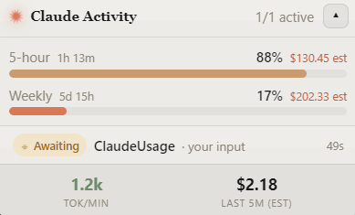

# Claude Activity Widget

A tiny always-on-top desktop widget that shows what **Claude Code** is doing right
now — live session activity, your real usage limits (the 5-hour and weekly bars),
and an estimated token "burn rate" — all in a little window that floats in the
corner of your screen.



> Replace the image above with a real screenshot once you have one, then delete
> this line.

---

## Do I need anything first?

**Yes — one thing:** you need to already be using **Claude Code** on this computer.

The widget doesn't log you in or ask for anything. It just quietly reads the data
Claude Code already keeps on your own machine and shows it in a nicer way. If you've
never run Claude Code here, there's nothing for the widget to show.

That's the only requirement. No accounts, no setup, no sign-in.

---

## Install (Windows)

1. Go to the [**Releases**](../../releases) page and download the latest
   **`Claude Activity Widget Setup.exe`**.
2. Double-click it.
3. **You'll probably see a blue "Windows protected your PC" box.** This is normal —
   it shows up for any app that isn't signed with a (pricey) certificate, not because
   anything is wrong. To continue:
   - Click **More info**
   - Click **Run anyway**
4. The widget installs and opens. That's it.

The widget floats on top of your other windows. You can:

- **Drag** it anywhere on screen.
- **Collapse** it to just the usage bars with the little ▴ / ▾ button.
- **Hide / show** it any time with **Alt + Shift + A**, or from the tray icon
  (the little terracotta square near your clock).
- **Quit** it from the tray icon's right-click menu.

---

## What it shows

- **Usage bars** — how much of your **5-hour** and **weekly** limits you've used, with
  a countdown to when each resets. Turns red when you're nearly out.
- **Live session activity** — every running Claude Code session shown as
  **Thinking / Editing / Reading / Running / Spawning agents / Needs you / Idle**,
  with the project, model, and time since last activity.
- **Burn rate** — roughly how fast you're spending tokens right now, with an estimated
  dollar equivalent. (It's only an estimate — subscription usage isn't billed per token.)

---

## Is this safe? What does it actually do?

Short version: it reads files that are already on your computer, and it never sends
your data anywhere new.

In a bit more detail:

- It reads Claude Code's local files in your `~/.claude` folder — the list of active
  sessions and their transcripts — to figure out what's happening and show it.
- To draw the usage bars, it makes the **same usage check Claude Code itself makes**
  to Anthropic's servers. Nothing else leaves your machine.
- There is **no server of its own**, no analytics, no tracking, no third parties.
  Everything runs locally on your computer.

It's open source — all the code is right here in this repo if you'd like to look.

---

## Uninstall

It's a normal Windows app: open **Settings → Apps → Installed apps**, find
**Claude Activity Widget**, and click **Uninstall**. (Or search "Add or remove
programs" in the Start menu.)

---

## For tinkerers: run or build it yourself

You don't need this section to *use* the widget — it's only if you want to run from
source or make your own build. You'll need [Node.js](https://nodejs.org).

```bash
npm install        # one-time, installs dependencies
npm run dev        # run it live with hot reload
npm run build      # production build into out/
npm start          # preview the production build
npm run package    # build your own Windows installer into dist/
npm run typecheck  # the only static check (no tests/linter configured)
```

### How it works (the short version)

All data is local under `~/.claude`:

| Source | Used for |
|---|---|
| `sessions/{pid}.json` | live sessions, busy/idle status |
| `projects/**/<sessionId>.jsonl` | per-session state + token usage (matched by sessionId) |
| `.credentials.json` (`claudeAiOauth`) | OAuth token for the usage API (auto-refreshed, written atomically) |

The usage endpoint (`GET https://api.anthropic.com/api/oauth/usage`) is undocumented;
it's isolated in `src/main/usageProvider.ts` so it can be swapped if it changes.
Polled every 180s with the required `claude-code/<version>` User-Agent.

- Set `CLAUDE_CONFIG_DIR` to point at a non-default `.claude` directory.
- Cost numbers are *estimates* from `src/main/pricing.ts` — update the rate table
  as prices change.

See [`CLAUDE.md`](CLAUDE.md) for the full architecture notes.

---

## License

[MIT](LICENSE) © kurious
